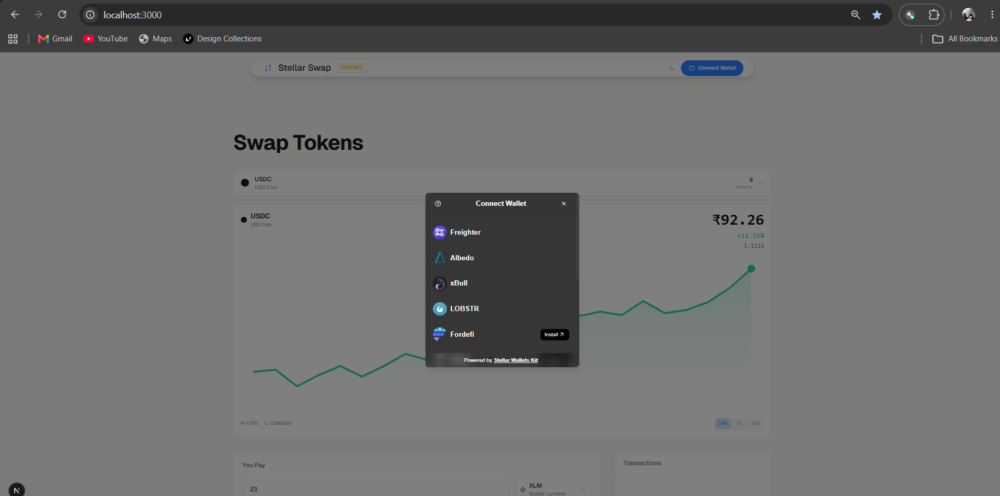
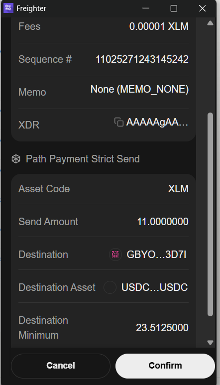

# Stellar Journey to Mastery

A progressive learning path to master Stellar blockchain development — one level at a time.

## Level 1: Simple Payment dApp (White Belt)

A minimal Stellar payment dApp on the Stellar testnet. Connect your Freighter wallet, view XLM balance, and send XLM to any Stellar address.

Built with **Next.js 16**, **TypeScript**, **Tailwind CSS v4**, and **@stellar/stellar-sdk**.

### Features

- Freighter wallet connect / disconnect
- XLM balance display with auto-refresh
- Send XLM to any Stellar address (G...)
- Testnet Friendbot funding (10,000 free XLM)
- Transaction status tracking (build → sign → submit → confirm)
- View transaction on StellarExpert
- Dark / light mode toggle
- Form validation + error handling for all states

### Setup

```sh
git clone https://github.com/shogun444/Journey-to-Mastery.git
cd Journey-to-Mastery
pnpm install
pnpm dev --filter=docs
```

Open [http://localhost:3001](http://localhost:3001).

### Screenshots

| Step | Screenshot |
|---|---|---|
| 1. Testnet transaction of 34 XLM | .png) |
| 2. Transaction on StellarExpert |  |
| 3. Successful transaction |  |
| 4. Transaction of 500 XLM with history |  |

### Tech Stack

| Category | Choice |
|---|---|
| Framework | Next.js 16 (App Router) |
| Language | TypeScript (strict) |
| Styling | Tailwind CSS v4 |
| Wallet | @stellar/freighter-api |
| SDK | @stellar/stellar-sdk (Horizon) |
| Icons | @phosphor-icons/react |
| Animations | CSS transitions only |
| Package manager | pnpm 9 |
| Dev port | 3001 |

## Level 2: Token Swap Interface (Yellow Belt)

A premium token swap dApp on the Stellar testnet. Multi-wallet support, DEX orderbook swaps, and high-end Ethereal Glass UI.

Built with **Next.js 16**, **TypeScript**, **Tailwind CSS v4**, **@stellar/stellar-sdk**, **@creit.tech/stellar-wallets-kit**, and **motion/react**.

### Features

- Multi-wallet support (Freighter, LOBSTR, xBull, Albedo, Rabet, Hana)
- Token balance display (XLM, USDC, Aqua, more)
- DEX orderbook integration via Horizon
- Path payment swaps with slippage protection
- Real-time swap rate display with orderbook depth
- Transaction status polling (pending → success/fail)
- Smart contract event emission for off-chain tracking
- **Premium UI:** Ethereal Glass design — radial gradients, noise grain texture, floating island nav, double-bezel cards, ambient shadows, spring animations
- Dark / light mode with adaptive glass tokens
- Comprehensive error handling (6+ types)

### Screenshots

| Step | Screenshot |
|---|---|---|
| 1. Home page (wallet connected) |  |
| 2. Multi-wallet selection modal |  |
| 3. Freighter transaction approval |  |
| 4. Freighter transaction details |  |
| 5. Successful transaction |  |
| 6. Transaction on StellarExpert |  |
| 7. USDC balance after conversion |  |
| 8. Cancelled transaction (user rejected) |  |

### Setup

```sh
cd apps/level-2
pnpm install
pnpm dev
```

Open [http://localhost:3000](http://localhost:3000).

### Smart Contract

Deployed AMM contract on Stellar testnet wrapping DEX path payments with `SwapExecuted` events.

- **Contract ID:** `CCKWIHACAVZC5OBGR7W2HL43KKOYYCL3XZJD5APOUFYBWMBS2FZXWYAF`
- **Deploy Tx:** [View on StellarExpert](https://stellar.expert/explorer/testnet/tx/99eae42899d64d41f529e6ceeed98c1520b063d19a441fe3786c972d80953e27)
- **Contract Call Tx:** [View on StellarExpert](https://stellar.expert/explorer/testnet/tx/416fb36f7cf87101400adc34ba5b4f49547bb71854aacf200502981a2fc4144f)

## Level 3: stXLM Liquid Staking Vault (Orange Belt)

[](https://www.youtube.com/watch?v=sQwNQjlO2u0)

**Live demo:** [https://journey-to-mastery-level-3.vercel.app](https://journey-to-mastery-level-3.vercel.app) · **Demo video:** [Watch on YouTube](https://www.youtube.com/watch?v=sQwNQjlO2u0)

A liquid staking protocol on Stellar Testnet. Stake XLM and receive stXLM, a yield-bearing receipt token. Inspired by the ERC-4626 tokenized vault standard, built with two Soroban smart contracts communicating via cross-contract calls.

Built with **Next.js 16**, **TypeScript**, **Tailwind CSS v4**, **motion/react**, **@stellar/stellar-sdk**, and **soroban-sdk**.

### Features

- **Smart Contracts:** stXLM token (SEP-41) + Vault (ERC-4626-inspired) with cross-contract communication
- **Multi-wallet:** Freighter, LOBSTR, xBull, Albedo, Rabet, Hana via Stellar Wallets Kit
- **Stake XLM:** Deposit XLM → receive stXLM with live preview + fee breakdown
- **Unstake stXLM:** Burn stXLM → withdraw XLM + accrued yield
- **Event-driven refresh:** Soroban `getEvents()` polling detects deposits/withdraws → instant re-fetch
- **Live market rate:** Streaming exchange rate with green/red trend indicators
- **Analytics:** 6 chart types (activity, rate history, portfolio, live market, stats)
- **Preview Display:** Live rate, slippage calculator, and fees shown inside the "You Receive" box with color-coded rate trend (green up / red down)
- **Optimistic UI:** Balance updates immediately on submit, reverts on failure
- **CI/CD:** GitHub Actions with format → clippy → test → build → deploy pipeline (10+ passing contract tests)
- **Production architecture:** Yield adapter interface, fee model, pause/unpause, treasury management
- **5 frontend pages:** Dashboard, Stake, Unstake, Analytics, Transactions

### Deployed Contracts (Testnet)

| Contract | Address | Explorer |
|----------|---------|----------|
| **stXLM Token** | `CDRE2N4LUYSRG77MB3K47XGI2MIV5OHX6CGXEYUEOKG3ALK25I2RZT2S` | [View](https://stellar.expert/explorer/testnet/contract/CDRE2N4LUYSRG77MB3K47XGI2MIV5OHX6CGXEYUEOKG3ALK25I2RZT2S) |
| **Vault** | `CAAVEIWGXQDBORNWDSNYMEB42L4A6Z6P3WC4QA3PLJ3U5IUXLYFQWQM5` | [View](https://stellar.expert/explorer/testnet/contract/CAAVEIWGXQDBORNWDSNYMEB42L4A6Z6P3WC4QA3PLJ3U5IUXLYFQWQM5) |

### On-Chain Transactions

| Type | Hash | Explorer |
|------|------|----------|
| Deposit (10 XLM → 10 stXLM) | `e1f6b1b21235a241de22c4c68017c2478eccddd0e6a090d21ee63b39d743722b` | [View on StellarExpert](https://stellar.expert/explorer/testnet/tx/e1f6b1b21235a241de22c4c68017c2478eccddd0e6a090d21ee63b39d743722b) |
| Withdraw (5 stXLM → 5 XLM) | `491e88ed620c8613c2caf256b45fc4f6b307e48e60253824c197f9916aaeb9b0` | [View on StellarExpert](https://stellar.expert/explorer/testnet/tx/491e88ed620c8613c2caf256b45fc4f6b307e48e60253824c197f9916aaeb9b0) |

### Setup

```sh
cd apps/level-3
npm install
cp .env.example .env.local
npm run dev
```

Open [http://localhost:3002](http://localhost:3002).

## Future Levels

| Level | Topic | Status |
|---|---|---|
| **1** | Simple Payment dApp (White Belt) | Complete |
| **2** | Token Swap Interface (Yellow Belt) | Complete |
| **3** | stXLM Liquid Staking Vault (Orange Belt) | Complete |

## Commands

```sh
pnpm dev --filter=docs       # Level 1 dev server (port 3001)
pnpm build --filter=docs     # Build Level 1
pnpm lint --filter=docs      # Lint Level 1
pnpm check-types --filter=docs   # TypeScript check (Level 1)
pnpm dev --filter=web        # Level 2 dev server (port 3000)
pnpm build --filter=web      # Build Level 2
pnpm lint --filter=web       # Lint Level 2
pnpm check-types --filter=web    # TypeScript check (Level 2)
cd apps/level-3 && npm run dev       # Level 3 dev server (port 3002)
cd apps/level-3 && npm run build     # Build Level 3
cd apps/level-3 && npm run lint      # Lint Level 3
cd apps/level-3 && npm run check-types  # TypeScript check (Level 3)
```
