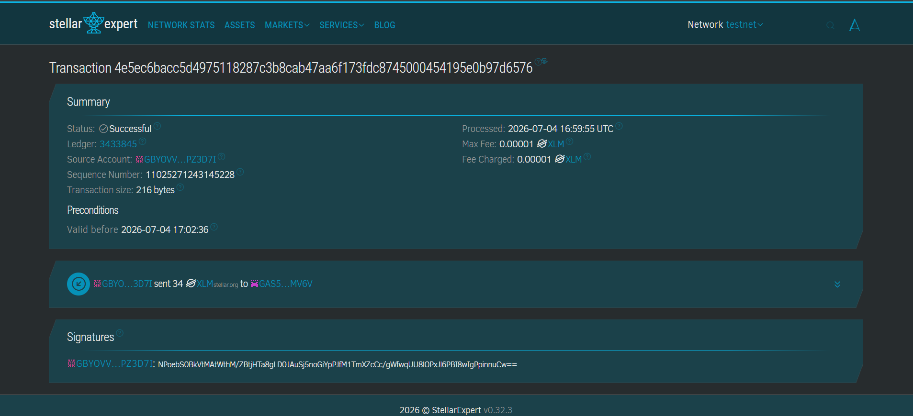
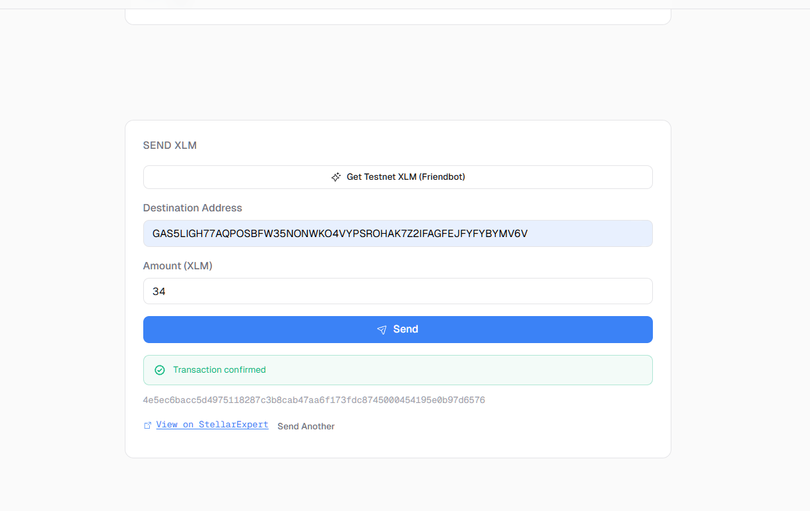
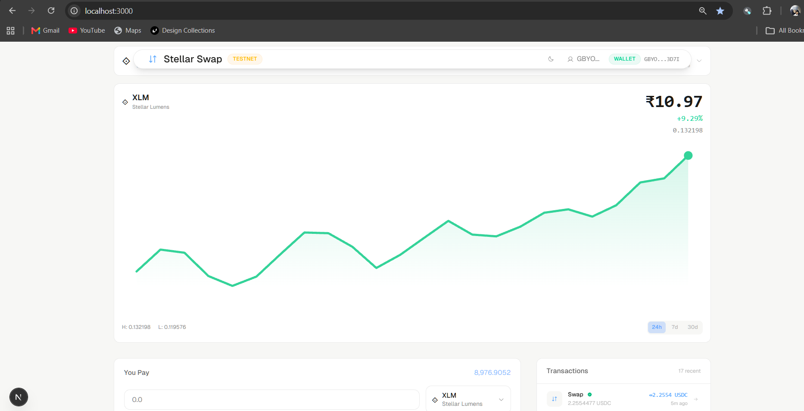
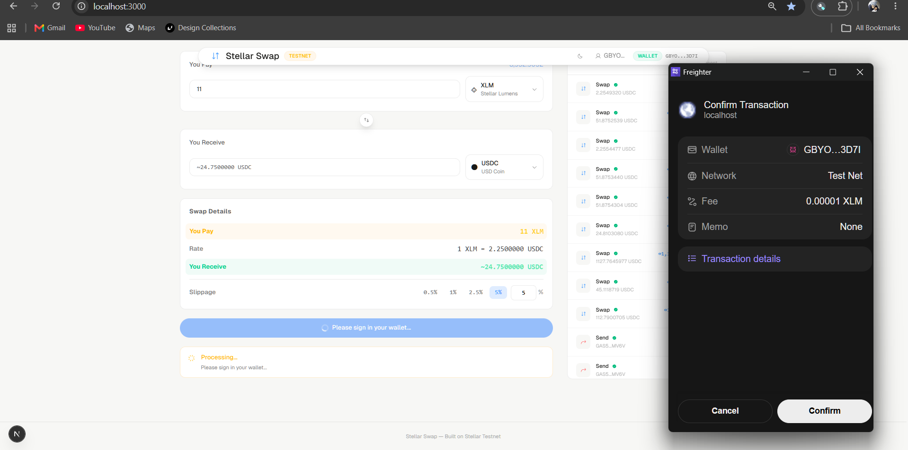
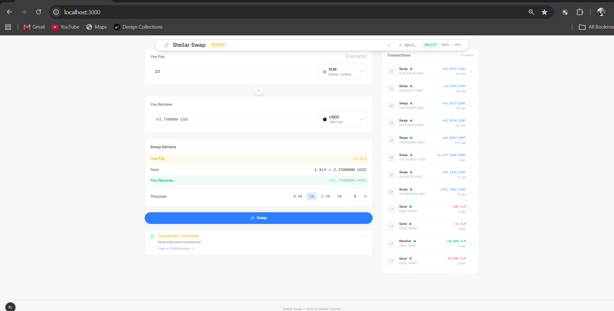
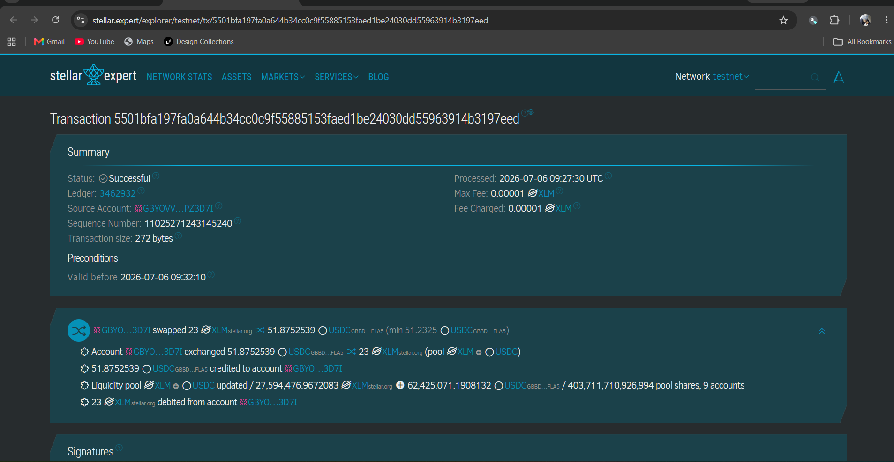
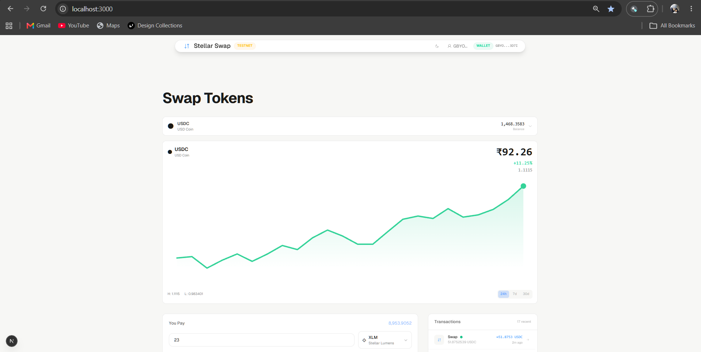
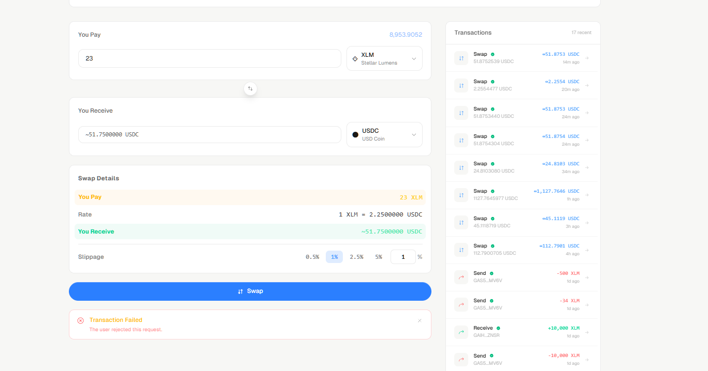

# Stellar Journey to Mastery

A progressive learning path to master Stellar blockchain development — one level at a time.

## Level 1: Simple Payment dApp (White Belt)

A minimal Stellar payment dApp on the Stellar testnet. Connect your Freighter wallet, view XLM balance, and send XLM to any Stellar address.

Built with **Next.js 16**, **TypeScript**, **Tailwind CSS v4**, and **@stellar/stellar-sdk**.

### Features

- Freighter wallet connect / disconnect
- XLM balance display with auto-refresh
- Send XLM to any Stellar address (G...)
- Testnet Friendbot funding (10,000 free XLM)
- Transaction status tracking (build → sign → submit → confirm)
- View transaction on StellarExpert
- Dark / light mode toggle
- Form validation + error handling for all states

### Setup

```sh
git clone https://github.com/shogun444/Journey-to-Mastery.git
cd Journey-to-Mastery
pnpm install
pnpm dev --filter=docs
```

Open [http://localhost:3001](http://localhost:3001).

### Screenshots

| Step | Screenshot |
|---|---|---|
| 1. Testnet transaction of 34 XLM | .png) |
| 2. Transaction on StellarExpert |  |
| 3. Successful transaction |  |
| 4. Transaction of 500 XLM with history |  |

### Tech Stack

| Category | Choice |
|---|---|
| Framework | Next.js 16 (App Router) |
| Language | TypeScript (strict) |
| Styling | Tailwind CSS v4 |
| Wallet | @stellar/freighter-api |
| SDK | @stellar/stellar-sdk (Horizon) |
| Icons | @phosphor-icons/react |
| Animations | CSS transitions only |
| Package manager | pnpm 9 |
| Dev port | 3001 |

## Level 2: Token Swap Interface (Yellow Belt)

A premium token swap dApp on the Stellar testnet. Multi-wallet support, DEX orderbook swaps, and high-end Ethereal Glass UI.

Built with **Next.js 16**, **TypeScript**, **Tailwind CSS v4**, **@stellar/stellar-sdk**, **@creit.tech/stellar-wallets-kit**, and **motion/react**.

### Features

- Multi-wallet support (Freighter, LOBSTR, xBull, Albedo, Rabet, Hana)
- Token balance display (XLM, USDC, Aqua, more)
- DEX orderbook integration via Horizon
- Path payment swaps with slippage protection
- Real-time swap rate display with orderbook depth
- Transaction status polling (pending → success/fail)
- Smart contract event emission for off-chain tracking
- **Premium UI:** Ethereal Glass design — radial gradients, noise grain texture, floating island nav, double-bezel cards, ambient shadows, spring animations
- Dark / light mode with adaptive glass tokens
- Comprehensive error handling (6+ types)

### Screenshots

| Step | Screenshot |
|---|---|---|
| 1. Home page (wallet connected) |  |
| 2. Freighter transaction approval |  |
| 3. Successful transaction |  |
| 4. Transaction on StellarExpert |  |
| 5. USDC balance after conversion |  |
| 6. Cancelled transaction (user rejected) |  |

### Setup

```sh
cd apps/level-2
pnpm install
pnpm dev
```

Open [http://localhost:3000](http://localhost:3000).

### Smart Contract

Deployed AMM contract on Stellar testnet wrapping DEX path payments with `SwapExecuted` events.

## Future Levels

| Level | Topic | Status |
|---|---|---|
| **1** | Simple Payment dApp (White Belt) | Complete |
| **2** | Token Swap Interface (Yellow Belt) | Complete |

## Commands

```sh
pnpm dev --filter=docs       # Level 1 dev server (port 3001)
pnpm build --filter=docs     # Build Level 1
pnpm lint --filter=docs      # Lint Level 1
pnpm check-types --filter=docs   # TypeScript check (Level 1)
pnpm dev --filter=web        # Level 2 dev server (port 3000)
pnpm build --filter=web      # Build Level 2
pnpm lint --filter=web       # Lint Level 2
pnpm check-types --filter=web    # TypeScript check (Level 2)
```
