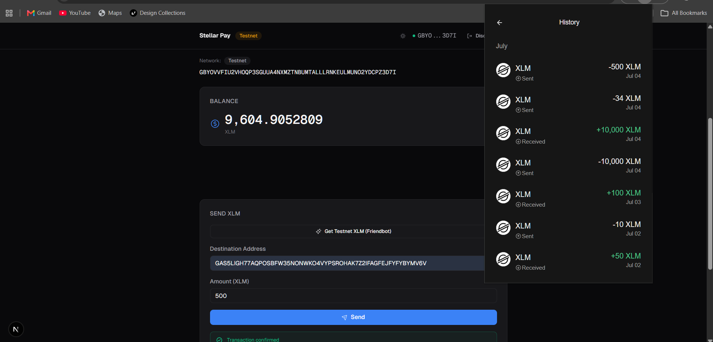

# Stellar Journey to Mastery

A progressive learning path to master Stellar blockchain development — one level at a time.

## Level 1: Simple Payment dApp (White Belt) ✅

A minimal Stellar payment dApp on the Stellar testnet. Connect your Freighter wallet, view XLM balance, and send XLM to any Stellar address.

Built with **Next.js 16**, **TypeScript**, **Tailwind CSS v4**, and **@stellar/stellar-sdk**.

### Features

- Freighter wallet connect / disconnect
- XLM balance display with auto-refresh
- Send XLM to any Stellar address (G...)
- Testnet Friendbot funding (10,000 free XLM)
- Transaction status tracking (build → sign → submit → confirm)
- View transaction on StellarExpert
- Dark / light mode toggle
- Form validation + error handling for all states

### Setup

```sh
git clone https://github.com/shogun444/Journey-to-Mastery.git
cd Journey-to-Mastery
pnpm install
pnpm dev --filter=docs
```

Open [http://localhost:3001](http://localhost:3001).

### Screenshots

| State | Screenshot |
|---|---|
| Wallet connected + balance |  |
| Successful transaction |  |
| Testnet transactions | .png) |
| StellarExpert explorer |  |

### Tech Stack

| Category | Choice |
|---|---|
| Framework | Next.js 16 (App Router) |
| Language | TypeScript (strict) |
| Styling | Tailwind CSS v4 |
| Wallet | @stellar/freighter-api |
| SDK | @stellar/stellar-sdk (Horizon) |
| Icons | @phosphor-icons/react |
| Animations | CSS transitions only |
| Package manager | pnpm 9 |
| Dev port | 3001 |

## Future Levels

| Level | Topic | Status |
|---|---|---|
| **1** | Simple Payment dApp (White Belt) | ✅ Complete |
| **2** | TBD | — |

## Commands

```sh
pnpm dev --filter=docs    # Level 1 dev server (port 3001)
pnpm build --filter=docs  # Build Level 1
pnpm lint --filter=docs   # Lint Level 1
pnpm check-types --filter=docs  # TypeScript check
```
