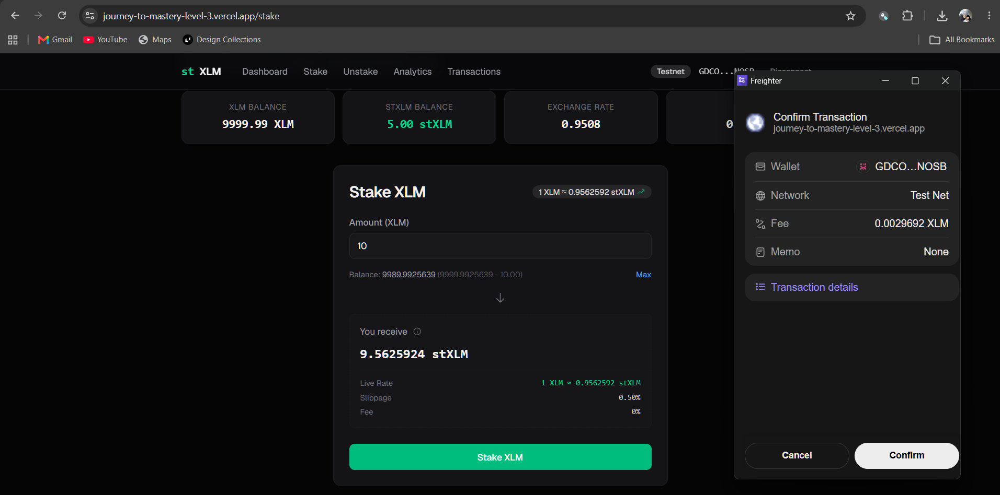
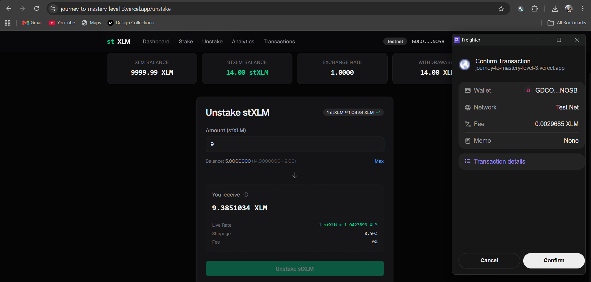

# stXLM — Liquid Staking Vault for Stellar (Level 3)

[](https://github.com/shogun444/Journey-to-Mastery/actions/workflows/ci.yml)

**Built for the Stellar Journey to Mastery Challenge — Level 3: Advanced Smart Contracts + Production-Ready dApps**

A liquid staking protocol on Stellar Testnet. Stake XLM and receive stXLM, a yield-bearing receipt token. Inspired by the ERC-4626 tokenized vault standard, built on Soroban smart contracts with cross-contract communication, event-driven architecture, and a production-ready CI/CD pipeline.

---

## Live Demo

> **[journey-to-mastery-level-3.vercel.app](https://journey-to-mastery-level-3.vercel.app)** — Deployed on Vercel

[](https://journey-to-mastery-level-3.vercel.app)
[](https://www.youtube.com/watch?v=sQwNQjlO2u0)

[](https://www.youtube.com/watch?v=sQwNQjlO2u0)

---

## Table of Contents

- [Smart Contracts](#smart-contracts)
- [Frontend](#frontend)
- [Deployed Contracts](#deployed-contracts-testnet)
- [On-Chain Transactions](#confirmed-on-chain-transactions)
- [Screenshots](#screenshots)
- [Getting Started](#getting-started)
- [Challenge Requirements](#challenge-requirements-checklist)
- [CI/CD Pipeline](#cicd-pipeline)
- [Documentation](#documentation)
- [Tech Stack](#tech-stack)

---

## Smart Contracts

Two Soroban contracts with cross-contract calls:

| Contract | Directory | Description |
|----------|-----------|-------------|
| **stXLM Token** | `contracts/st-xlm/` | SEP-41 fungible token with mint/burn authority restricted to the vault |
| **Vault** | `contracts/vault/` | ERC-4626-inspired vault with deposit, withdraw, exchange rate, fee model, pause/unpause, and mock yield simulation |

### Events

| Event | Topics | Description |
|-------|--------|-------------|
| `Deposited` | `deposited` | Emitted on XLM deposit |
| `Withdrawn` | `withdrawn` | Emitted on stXLM withdrawal |
| `ExchangeRateUpdated` | `exchange_rate_updated` | Emitted after any state change |
| `FeeUpdated` | `fee_updated` | Emitted on fee parameter change |
| `TreasuryUpdated` | `treasury_updated` | Emitted on treasury address change |
| `Paused` | `paused` | Emitted when vault is paused |
| `Unpaused` | `unpaused` | Emitted when vault is unpaused |
| `YieldSimulated` | `yield_simulated` | Emitted on mock yield simulation |

### Exchange Rate Model (ERC-4626)

```
shares = (assets x total_supply) / total_assets
assets = (shares x total_assets) / total_supply
rate   = total_assets / total_supply
```

---

## Frontend

Next.js 16 (App Router), Tailwind CSS v4, motion/react, Stellar Wallets Kit (Freighter, LOBSTR, xBull, Albedo, Rabet, Hana).

| Page | Route | Description |
|------|-------|-------------|
| Dashboard | `/` | Portfolio overview with XLM and stXLM balances and exchange rate |
| Stake | `/stake` | Deposit XLM, preview stXLM shares, optimistic UI |
| Unstake | `/unstake` | Burn stXLM, preview XLM payout, optimistic UI |
| Analytics | `/analytics` | Protocol metrics - TVL, APY, total supply, exchange rate history, activity chart |
| Transactions | `/transactions` | On-chain transaction history from Horizon plus Soroban events |

### Key Features

- **Multi-wallet:** 6 Stellar wallets via Stellar Wallets Kit (Freighter, LOBSTR, xBull, Albedo, Rabet, Hana)
- **Event-driven refresh:** Soroban getEvents() polling detects Deposited/Withdrawn events for instant re-fetch
- **Optimistic UI:** Balance updates immediately on submit, reverts on failure
- **On-chain analytics:** Chart data derived from real vault events, not local storage
- **Live exchange rate:** Streaming stXLM/XLM rate with green/red trend indicators
- **Preview Display:** Live rate, slippage calculator, and fees shown inside the "You Receive" box
- **Mobile responsive:** Hamburger menu, responsive grids, mobile-optimized transaction rows
- **Dark mode:** Zinc-based dark color scheme

---

## Deployed Contracts (Testnet)

| Contract | Address | Explorer |
|----------|---------|----------|
| stXLM Token | `CDRE2N4LUYSRG77MB3K47XGI2MIV5OHX6CGXEYUEOKG3ALK25I2RZT2S` | [View on StellarExpert](https://stellar.expert/explorer/testnet/contract/CDRE2N4LUYSRG77MB3K47XGI2MIV5OHX6CGXEYUEOKG3ALK25I2RZT2S) |
| Vault | `CAAVEIWGXQDBORNWDSNYMEB42L4A6Z6P3WC4QA3PLJ3U5IUXLYFQWQM5` | [View on StellarExpert](https://stellar.expert/explorer/testnet/contract/CAAVEIWGXQDBORNWDSNYMEB42L4A6Z6P3WC4QA3PLJ3U5IUXLYFQWQM5) |

## Confirmed On-Chain Transactions

| Type | Amount | Hash | Explorer |
|------|--------|------|----------|
| Deposit | 10 XLM → 10 stXLM (1:1) | `e1f6b1b21235a241de22c4c68017c2478eccddd0e6a090d21ee63b39d743722b` | [View on StellarExpert](https://stellar.expert/explorer/testnet/tx/e1f6b1b21235a241de22c4c68017c2478eccddd0e6a090d21ee63b39d743722b) |
| Withdraw | 5 stXLM → 5 XLM (1:1) | `491e88ed620c8613c2caf256b45fc4f6b307e48e60253824c197f9916aaeb9b0` | [View on StellarExpert](https://stellar.expert/explorer/testnet/tx/491e88ed620c8613c2caf256b45fc4f6b307e48e60253824c197f9916aaeb9b0) |

---

## Screenshots

| Stake | Stake Details |
|-------|---------------|
|  | .png) |

| Unstake | Unstake Details |
|---------|-----------------|
|  | .png) |

| Deposit on StellarExpert | Withdraw on StellarExpert |
|--------------------------|---------------------------|
| .png) | .png) |

---

## Getting Started

### Prerequisites

- Node.js 20+
- Rust 1.96+ with wasm32v1-none target
- stellar CLI v27.0.0+
- Freighter browser extension (for wallet connection)

### Frontend

```bash
cd apps/level-3
npm install
cp .env.example .env.local
npm run dev
```

Opens at [http://localhost:3002](http://localhost:3002).

### Smart Contracts

Build:
```bash
cd contracts/st-xlm
cargo build --target wasm32v1-none --release
cd ../vault
cargo build --target wasm32v1-none --release
```

Test:
```bash
cd contracts/st-xlm && cargo test
cd contracts/vault && cargo test
```

10 contract tests pass (6 vault + 4 token).

Deploy: See `docs/deployment.md`.

---

## Challenge Requirements Checklist

| Requirement | Status |
|-------------|--------|
| Smart contract development (2 contracts, cross-contract calls) | Complete |
| Inter-contract communication (Vault to stXLM token) | Complete |
| Event streaming and real-time updates (Soroban getEvents() polling) | Complete |
| CI/CD pipeline (GitHub Actions: format, clippy, test, build, deploy) | Complete |
| Smart contract deployment workflow (WASM build to testnet) | Complete |
| Mobile responsive frontend (hamburger menu, responsive grids) | Complete |
| Error handling and loading states (7 error types, loading skeletons) | Complete |
| Contract tests (10+ passing — 6 vault + 4 token) | Complete |
| Production-ready architecture (fee model, pause/unpause, treasury, yield adapter) | Complete |
| Documentation and demo (architecture, security, tokenomics, math, roadmap, deployment) | Complete |

---

## CI/CD Pipeline

```
Format (Rust) → Clippy → Cargo Test → WASM Build → Lint → TypeScript Check → Vitest → Next Build
```

Runs on every push to `main` and on pull requests.

---

## Documentation

- [Architecture](docs/architecture.md)
- [Security](docs/security.md)
- [Tokenomics](docs/tokenomics.md)
- [Math](docs/math.md)
- [Roadmap](docs/roadmap.md)
- [Deployment](docs/deployment.md)

---

## Tech Stack

| Category | Choice |
|----------|--------|
| Framework | Next.js 16 (App Router) |
| Language | TypeScript strict, Rust (#![no_std]) |
| Styling | Tailwind CSS v4 |
| Wallet | @creit.tech/stellar-wallets-kit (6 wallets) |
| SDK | @stellar/stellar-sdk v16 |
| Animations | motion/react |
| Icons | @phosphor-icons/react |
| Smart Contracts | soroban-sdk v25 (2 contracts: stXLM + Vault) |
| Contract Target | wasm32v1-none |
| Charts | recharts |
| Package manager | npm (apps/level-3) |
| Dev port | 3002 |

## Network

Testnet only. Yield is simulated via `simulate_yield()` because testnet XLM has no real value. The vault is designed with a yield adapter interface for future production strategies (Blend, Soroswap, etc.).
